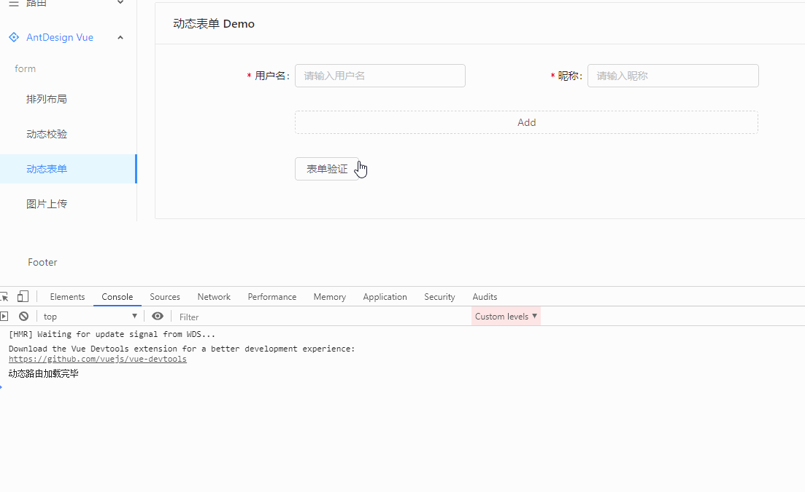

## 动态表单

复杂的后端管理系统，逃不掉表单元素的动态生成，结合 Antd 就会有这几个问题：

- 怎么在已经写好的 Form 表单中，增添新的表单元素？
- 怎么友好的添加新表单字段？甚至是一批字段？
- 这些字段怎么纳入原先的 validate 校验体系？

我参考官网的 **[动态增减表单项-示例](https://www.antdv.com/components/form-cn/)** ，再“绞尽脑汁”准备了还算过得去的 demo。

下面看下效果图，同时我会做简单的说明：



### 如何动态添加元素？

往页面上添加元素到是不难，现在前端框架都是基于数据驱动的。

所以只要维护一个（数组）变量（例中为：dynamicGroup），然后根据修改逻辑，往这个数组中增减元素，最后通过 v-for 动态渲染出对应的表单标签即可。

```html
<a-row v-for="(dynamicFields, index) of dynamicGroup" :key="index">
  <a-col>
    <!-- form-item -->
  </a-col>
</a-row>
```

### 怎么友好添加新的表单字段？

在 dynamicGroup 动态元素集合中，我放的是“一批”动态的字段（也是数组类型）。

```js
// data
{
    dynamicGroup: [],
    dynamicFields: [
    {
        fieldName: 'username',
        //...
    },
    {
        fieldName: 'nickname',
        //...
    }
}
```

然后在对应的添加逻辑中，直接将预设的 dynamicFields 规则作为新元素放到 dynamicGroup 中：

```js
addDynamicGroup() {
    this.dynamicGroup.push(this.dynamicFields)
}
```

如果你每次添加的操作中，包含一批字段就可以维护在 dynamicFields 中，如果只有一个字段，就维护一个数组就行。

然后每个 dynamicFields 元素，可以维护 \<a-form-item> 常用的属性（比如：label、placeholder...）

```js
{
    fieldName: 'username',
    label: '用户名',
    placeholder: '请输入用户名',
}
```

### 怎么和表单校验联动处理？

你应该注意到：我在 dynamicFields 中的每个字段对象中定义了一个 decorator 方法（而非 key-value）

```js
{
    fieldName: 'username',
    label: '用户名',
    placeholder: '请输入用户名',
    decorator(key) {
    return [key, {
        rules: [{
        required: true,
        message: '请输入用户名'
        }]
    }]
    }
}
```

这样的好处就是，我能在 template 直接调用该方法，然后传入一个“唯一”值，这样最后 form 的验证就能根据不同的 key 进行独一无二的校验。

```html
<a-input :placeholder="item.placeholder" v-decorator="item.decorator(`tree[${index}][${item.fieldName}]`)" />
```

注意到，我这个 key 也不是随便设置的：

```js
tree[${index}][${item.fieldName}]
```

假设后端对应有个 tree 的数组数据，内部元素也是和 fieldName 对应，那么还能正确表单回显。

同时最后表单输入的数据，结构还能“原封不动”的通过接口传给后端，很完美。
