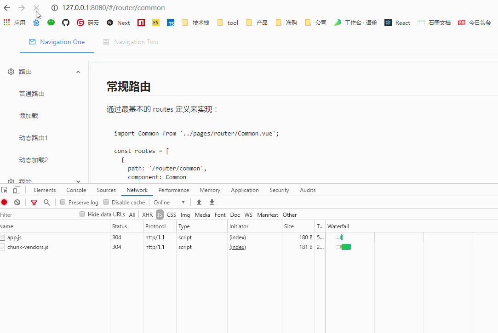

## 路由懒加载

通过 webpack 的 **Code Splitting** 机制实现：

```js
import Common from '../pages/router/Common.vue';

const routes = [
  {
    path: '/router/common',
    component: Common,
  },
  {
    path: '/router/lazy',
    component: () => import(/*webpackChunkName: "router-lazy"*/ '../pages/router/Lazy.vue'),
  },
];
```

如下三种方式将触发 **Code Splitting** 代码分割：

- 通过 entry 定义多入口文件
- 结合 SplitChunksPlugin，分割不同的 chunks 文件
- **使用 import() API**

路由懒加载基于第三种 import 方式实现。当请求对应路由时，将看到额外的 js 文件请求，为首屏加载提速：



### Tips

可以通过 /_webpackChunkName: "router-lazy"_/ 特定的注释，来对额外生成的文件定义名字。
